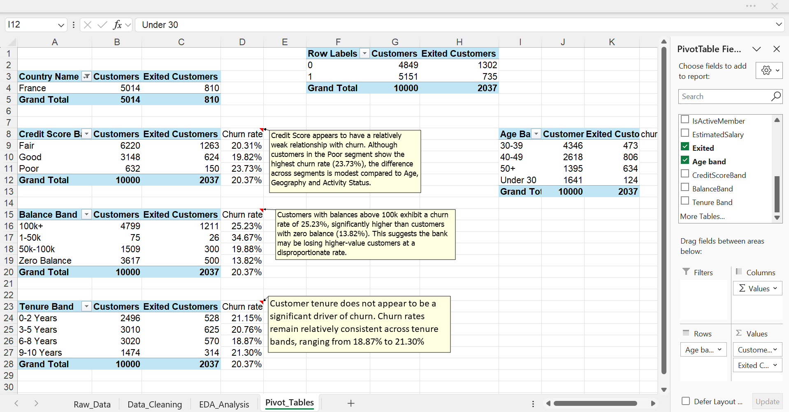

# 📊 Banking Risk Analytics using Microsoft Excel

## 🎯 Project Objective

The objective of this project was to analyse customer churn behaviour within a banking dataset using Microsoft Excel and identify key business factors associated with customer attrition.
## 📂 Dataset Source

The analysis is based on a banking customer churn dataset used across my Excel, SQL, and Power BI projects.

📄 **Raw Dataset:**   https://raw.githubusercontent.com/vinni1999bhardwaj-code/Customer-Churn-Dashboard-PowerBI/main/Churn_Modelling.csv

The analysis focused on customer demographics, account activity, balances, tenure, credit score, and product ownership to uncover meaningful business insights and support data-driven decision-making.

---

## 🛠️ Tools & Excel Techniques
This project was developed entirely in Microsoft Excel using a combination of data preparation, validation, analysis, and reporting techniques.
- Pivot Tables
- Conditional Formatting
- Data Validation
- Structured Excel Tables
- Lookup Functions
- IF Statements
- COUNTIF / SUMIF Functions
- Customer Segmentation
- KPI Development
- Business Reporting

---

## 📋 Project Workflow

This project follows a structured Excel-based analytics workflow designed to transform raw banking customer data into meaningful business insights.

The analysis was completed through four key stages:

1. Data Collection & Understanding
2. Data Cleaning & Validation
3. Exploratory Data Analysis (EDA)
4. Pivot-Based Business Analysis

The objective was not only to analyse customer churn patterns but also to demonstrate advanced Excel techniques commonly used in business reporting and analytical workflows.

---

## 🧹 Data Cleaning & Validation
Before analysis, the dataset was validated to ensure accuracy and consistency.

### Tasks Performed

- Missing value identification
- Duplicate record detection
- Customer ID validation
- Dataset structure verification
- Record count validation

### Excel Techniques Used

- COUNTIF()
- COUNTA()
- Conditional Formatting
- Data Validation
- Structured Tables
- Logical Checks
- UNIQUE()
- ROWS()

### Outcome

The dataset passed all quality checks and was confirmed suitable for further analysis.

---

## 📊 Exploratory Data Analysis

Exploratory analysis was performed to identify customer churn patterns and understand customer behaviour.

### Analysis Conducted

- Churn rate analysis
- Customer segmentation
- Geographic analysis
- Age-group comparison
- Product ownership assessment
- Activity status evaluation

### Excel Techniques Used

- AVERAGEIF()
- Structured Tables
- Customer Segmentation
- Percentage Analysis
- Comparative Analysis
- Business Profiling
- Summary Metrics
- Churn Rate Calculations
- Conditional Formatting

### Outcome

Several high-risk customer segments were identified, providing a foundation for deeper business analysis.

---

## 📑 Advanced Pivot Table Analysis

Pivot Tables were used to transform raw customer data into actionable business insights.

### Analysis Performed

- Geography-wise churn comparison
- Age-band analysis
- Balance segmentation
- Credit score evaluation
- Product ownership analysis
- Customer activity assessment

### Advanced Excel Features Demonstrated

- Pivot Tables
- Multi-level Pivot Analysis
- Custom Grouping
- Dynamic Aggregations
- Customer Segmentation
- KPI Development
- Churn Rate Calculations
- Comparative Trend Analysis
- Business Insight Generation

### Business Impact

The analysis highlighted key churn drivers and identified customer segments requiring targeted retention strategies.

---

## 📊 Key Findings from Excel Analysis

### Geographic Differences Exist

Certain regions experienced higher customer attrition, suggesting market-specific retention challenges.

### Product Ownership Alone Is Not Enough

Customers owning multiple products did not always display stronger retention behaviour.

### Data Segmentation Improves Insight Discovery

Using Pivot Tables and customer segmentation techniques helped identify high-risk customer groups more effectively.

---
## 📌 Business Insights & Recommendations

Detailed customer churn insights, business findings, and strategic recommendations were generated during the SQL analysis phase and can be accessed below:

🔗 [Explore Full SQL Analysis Repository](https://github.com/vinni1999bhardwaj-code/Customer-Churn-SQL-Analysis)

# 👩‍💻 Author

### Vinita Bhardwaj

Aspiring Data Analyst | Excel | SQL | Power BI

📧 Email: [vinni1999bhardwaj@gmail.com](mailto:vinni1999bhardwaj@gmail.com)

🔗 LinkedIn: https://www.linkedin.com/in/vinita-bhardwaj-2a9627227

🔗 GitHub: https://github.com/vinni1999bhardwaj-code
